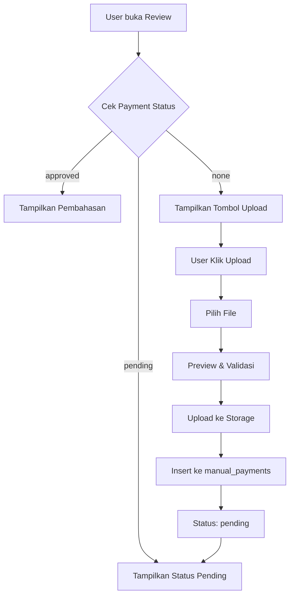

# 📚 Dokumentasi Fitur Payment Upload untuk Pembahasan

## 📋 Daftar Isi
1. [Overview](#overview)
2. [Fitur yang Ditambahkan](#fitur-yang-ditambahkan)
3. [Struktur Database](#struktur-database)
4. [Komponen yang Dimodifikasi](#komponen-yang-dimodifikasi)
5. [Flow Sistem](#flow-sistem)
6. [Setup & Konfigurasi](#setup--konfigurasi)
7. [Testing](#testing)
8. [Troubleshooting](#troubleshooting)

---

## 🎯 Overview

Fitur ini memungkinkan user untuk mengupload bukti pembayaran manual sebesar **Rp 15.000** untuk membuka akses pembahasan soal pada tryout tertentu. Setelah admin menyetujui pembayaran, user akan mendapatkan akses untuk melihat pembahasan lengkap.

### Alur Kerja:
1. User melihat review soal dengan pembahasan terkunci
2. User klik tombol "Upload Bukti Pembayaran"
3. User upload bukti transfer ke sistem
4. Admin review dan approve pembayaran
5. User mendapatkan akses pembahasan lengkap

---

## ✨ Fitur yang Ditambahkan

### 1. **Payment Status Tracking**
- Tracking 3 status: `none`, `pending`, `approved`
- Auto-check status saat komponen dimount
- Real-time update setelah upload

### 2. **Upload Modal**
- Form upload bukti pembayaran
- Preview gambar sebelum upload
- Validasi file (image only, max 5MB)
- Loading state & error handling
- Informasi rekening bank

### 3. **Conditional Display**
- ✅ **Approved**: Tampilkan pembahasan lengkap
- ⏳ **Pending**: Tampilkan status "Menunggu Konfirmasi"
- 🔒 **None**: Tampilkan tombol upload bukti

---

## 🗄️ Struktur Database

### Tabel: `manual_payments`

Tabel ini sudah ada dengan struktur:

```sql
CREATE TABLE public.manual_payments (
  id UUID PRIMARY KEY DEFAULT uuid_generate_v4(),
  user_id UUID NOT NULL,
  tryout_id UUID NOT NULL,
  amount INTEGER NOT NULL DEFAULT 15000,
  payment_proof_url TEXT NULL,
  payment_method TEXT NULL,
  account_name TEXT NULL,
  payment_date TIMESTAMP WITHOUT TIME ZONE NULL,
  status TEXT NULL DEFAULT 'pending',
  admin_notes TEXT NULL,
  reviewed_by UUID NULL,
  reviewed_at TIMESTAMP WITHOUT TIME ZONE NULL,
  created_at TIMESTAMP WITHOUT TIME ZONE NULL DEFAULT NOW(),
  updated_at TIMESTAMP WITHOUT TIME ZONE NULL DEFAULT NOW(),
  
  CONSTRAINT manual_payments_pkey PRIMARY KEY (id),
  CONSTRAINT manual_payments_user_id_tryout_id_key UNIQUE (user_id, tryout_id),
  CONSTRAINT manual_payments_reviewed_by_fkey FOREIGN KEY (reviewed_by) REFERENCES profiles (id),
  CONSTRAINT manual_payments_tryout_id_fkey FOREIGN KEY (tryout_id) REFERENCES tryouts (id),
  CONSTRAINT manual_payments_user_id_fkey FOREIGN KEY (user_id) REFERENCES profiles (id)
);

-- Indexes
CREATE INDEX idx_manual_payments_user ON manual_payments(user_id);
CREATE INDEX idx_manual_payments_status ON manual_payments(status);
CREATE INDEX idx_manual_payments_tryout ON manual_payments(tryout_id);
```

### Tabel: `unlocked_explanations`

Tabel untuk tracking pembahasan yang sudah di-unlock:

```sql
CREATE TABLE unlocked_explanations (
  id UUID PRIMARY KEY DEFAULT uuid_generate_v4(),
  user_id UUID NOT NULL REFERENCES profiles(id),
  tryout_id UUID NOT NULL REFERENCES tryouts(id),
  unlocked_at TIMESTAMP WITH TIME ZONE DEFAULT NOW(),
  UNIQUE(user_id, tryout_id)
);

CREATE INDEX idx_unlocked_explanations_user ON unlocked_explanations(user_id);
CREATE INDEX idx_unlocked_explanations_tryout ON unlocked_explanations(tryout_id);
```

### Storage Bucket: `payment-proofs`

Bucket untuk menyimpan bukti pembayaran:
- **Type**: Public bucket
- **Path structure**: `payment-proofs/{userId}_{tryoutId}_{timestamp}.{ext}`

---

## 🔧 Komponen yang Dimodifikasi

### 1. **ReviewQuestionCard.tsx**

File: `components/review/ReviewQuestionCard.tsx`

#### State yang Ditambahkan:
```typescript
const [showPaymentModal, setShowPaymentModal] = useState(false);
const [paymentStatus, setPaymentStatus] = useState<'none' | 'pending' | 'approved'>('none');
```

#### Function yang Ditambahkan:

**a. checkPaymentStatus()**
```typescript
const checkPaymentStatus = async () => {
  const { data: { session } } = await supabase.auth.getSession();
  if (!session) return;
  
  const { data } = await supabase
    .from('manual_payments')
    .select('status')
    .eq('user_id', session.user.id)
    .eq('tryout_id', question.tryout_id)
    .single();
  
  if (data) {
    setPaymentStatus(data.status === 'approved' ? 'approved' : 'pending');
  }
};
```

**b. PaymentProofUpload Component**

Sub-komponen baru untuk handle upload:
- File selection & preview
- Upload ke Supabase Storage
- Insert record ke database
- Error handling

#### UI Changes:

**Before:**
```jsx
{hasPaid ? (
  <div>Pembahasan...</div>
) : (
  <div>Terkunci</div>
)}
```

**After:**
```jsx
{hasPaid || paymentStatus === 'approved' ? (
  <div>Pembahasan...</div>
) : paymentStatus === 'pending' ? (
  <div>Menunggu Konfirmasi...</div>
) : (
  <div>
    <button onClick={() => setShowPaymentModal(true)}>
      Upload Bukti
    </button>
  </div>
)}
```

---

## 🔄 Flow Sistem

### 1. **User Flow**



### 2. **Admin Flow**

```
1. Admin masuk ke halaman approval
2. Lihat list pending payments
3. Review bukti transfer
4. Approve/Reject payment
5. Jika approve:
   - Update status di manual_payments
   - Insert ke unlocked_explanations
6. User bisa lihat pembahasan
```

### 3. **Data Flow**

```
User Upload → Supabase Storage (payment-proofs bucket)
           ↓
        Get Public URL
           ↓
        manual_payments table (status: pending)
           ↓
        Admin Approval
           ↓
        Update status → approved
           ↓
        Insert to unlocked_explanations
           ↓
        User sees explanation
```

---

## ⚙️ Setup & Konfigurasi

### 1. **Database Setup**

#### RLS Policies untuk `manual_payments`:

```sql
-- Enable RLS
ALTER TABLE manual_payments ENABLE ROW LEVEL SECURITY;

-- Users can insert their own payment proofs
CREATE POLICY "Users can insert their own payment proofs"
ON manual_payments
FOR INSERT
TO authenticated
WITH CHECK (auth.uid() = user_id);

-- Users can view their own payment proofs
CREATE POLICY "Users can select their own payment proofs"
ON manual_payments
FOR SELECT
TO authenticated
USING (auth.uid() = user_id);

-- Admins can view all payment proofs
CREATE POLICY "Admins can view all payment proofs"
ON manual_payments
FOR ALL
TO authenticated
USING (
  EXISTS (
    SELECT 1 FROM profiles
    WHERE profiles.id = auth.uid()
    AND profiles.role = 'admin'
  )
);
```

#### RLS Policies untuk `unlocked_explanations`:

```sql
-- Enable RLS
ALTER TABLE unlocked_explanations ENABLE ROW LEVEL SECURITY;

-- Admins can insert unlocked explanations
CREATE POLICY "Admins can insert unlocked explanations"
ON unlocked_explanations
FOR INSERT
TO authenticated
WITH CHECK (
  EXISTS (
    SELECT 1 FROM profiles
    WHERE profiles.id = auth.uid()
    AND profiles.role = 'admin'
  )
);

-- Users can view their unlocked explanations
CREATE POLICY "Users can view their unlocked explanations"
ON unlocked_explanations
FOR SELECT
TO authenticated
USING (user_id = auth.uid());

-- Admins can view all unlocked explanations
CREATE POLICY "Admins can view all unlocked explanations"
ON unlocked_explanations
FOR SELECT
TO authenticated
USING (
  EXISTS (
    SELECT 1 FROM profiles
    WHERE profiles.id = auth.uid()
    AND profiles.role = 'admin'
  )
);
```

### 2. **Storage Setup**

#### Buat Bucket:

```sql
-- Buat bucket payment-proofs
INSERT INTO storage.buckets (id, name, public)
VALUES ('payment-proofs', 'payment-proofs', true)
ON CONFLICT (id) DO NOTHING;
```

#### Storage Policies:

```sql
-- Policy untuk upload
CREATE POLICY "payment_proofs_insert_policy"
ON storage.objects
FOR INSERT
TO authenticated
WITH CHECK (bucket_id = 'payment-proofs');

-- Policy untuk view
CREATE POLICY "payment_proofs_select_policy"
ON storage.objects
FOR SELECT
TO authenticated
USING (bucket_id = 'payment-proofs');

-- Policy untuk delete
CREATE POLICY "payment_proofs_delete_policy"
ON storage.objects
FOR DELETE
TO authenticated
USING (bucket_id = 'payment-proofs');
```

### 3. **Environment Variables**

Pastikan Supabase URL dan Key sudah di-set di `.env.local`:

```env
NEXT_PUBLIC_SUPABASE_URL=your_supabase_url
NEXT_PUBLIC_SUPABASE_ANON_KEY=your_supabase_anon_key
```

### 4. **Informasi Bank**

Update informasi bank di `PaymentProofUpload` component:

```typescript
<div className="bg-blue-50 dark:bg-blue-900/20 p-4 rounded-lg">
  <h4 className="font-semibold text-blue-800 dark:text-blue-300 mb-2">
    Informasi Pembayaran
  </h4>
  <div className="text-sm text-blue-700 dark:text-blue-400 space-y-1">
    <p><strong>Bank:</strong> BCA</p>
    <p><strong>No. Rekening:</strong> 1234567890</p>
    <p><strong>Atas Nama:</strong> TKA Tryout</p>
    <p><strong>Jumlah:</strong> Rp 15.000</p>
  </div>
</div>
```

---

## 🧪 Testing

### Test Cases:

#### 1. **Upload Bukti Pembayaran**
- [ ] User bisa pilih file gambar
- [ ] Preview gambar muncul setelah pilih file
- [ ] Validasi file type (hanya image)
- [ ] Validasi file size (max 5MB)
- [ ] Upload berhasil ke storage
- [ ] Record masuk ke `manual_payments` dengan status `pending`
- [ ] Modal close setelah success

#### 2. **Payment Status Display**
- [ ] Status `none`: Tombol "Upload Bukti" muncul
- [ ] Status `pending`: Badge "Menunggu Konfirmasi" muncul
- [ ] Status `approved`: Pembahasan lengkap ditampilkan

#### 3. **Error Handling**
- [ ] Error message muncul jika upload gagal
- [ ] Error message muncul jika file > 5MB
- [ ] Error message muncul jika bukan file gambar
- [ ] Error message muncul jika tidak login

#### 4. **Admin Approval**
- [ ] Admin bisa lihat pending payments
- [ ] Admin bisa approve payment
- [ ] Status berubah jadi `approved`
- [ ] Record masuk ke `unlocked_explanations`
- [ ] User bisa lihat pembahasan setelah approve

### Manual Testing Steps:

```bash
# 1. Test sebagai User
1. Login sebagai user biasa
2. Buka halaman review tryout
3. Klik "Upload Bukti Pembayaran"
4. Upload gambar bukti transfer
5. Cek di database: SELECT * FROM manual_payments WHERE user_id = 'xxx';
6. Refresh page, pastikan status "Menunggu Konfirmasi"

# 2. Test sebagai Admin
1. Login sebagai admin
2. Buka halaman payment approval
3. Approve payment yang baru diupload
4. Cek database: 
   - manual_payments status = 'approved'
   - unlocked_explanations ada record baru

# 3. Test sebagai User (lagi)
1. Login lagi sebagai user
2. Buka halaman review yang sama
3. Pastikan pembahasan sudah terbuka
```

---

## 🔍 Troubleshooting

### 1. **Error: "new row violates row-level security policy"**

**Penyebab:** RLS policy belum dibuat atau tidak sesuai

**Solusi:**
```sql
-- Cek policy yang ada
SELECT * FROM pg_policies WHERE tablename = 'manual_payments';
SELECT * FROM pg_policies WHERE tablename = 'unlocked_explanations';

-- Jalankan ulang RLS policies di section Setup
```

### 2. **Error: "Failed to upload file to storage"**

**Penyebab:** Storage bucket atau policy belum dibuat

**Solusi:**
```sql
-- Cek bucket
SELECT * FROM storage.buckets WHERE name = 'payment-proofs';

-- Cek storage policies
SELECT * FROM pg_policies 
WHERE schemaname = 'storage' 
AND tablename = 'objects';

-- Jalankan ulang storage setup
```

### 3. **Error: "Unique constraint violation"**

**Penyebab:** User sudah pernah upload untuk tryout yang sama

**Solusi:**
- Cek di database apakah sudah ada record
- Jika status `pending`, user tunggu approval
- Jika perlu upload ulang, delete record lama dulu

### 4. **Status tidak update setelah admin approve**

**Penyebab:** Cache atau tidak refresh

**Solusi:**
- Refresh page
- Clear browser cache
- Cek di database apakah status sudah berubah

### 5. **Preview gambar tidak muncul**

**Penyebab:** File reader error

**Solusi:**
- Pastikan file valid
- Cek console untuk error
- Try dengan gambar lain

---

## 📊 Monitoring & Logging

### Query Monitoring:

```sql
-- Lihat semua pending payments
SELECT 
  mp.*,
  p.full_name as user_name,
  t.title as tryout_title
FROM manual_payments mp
JOIN profiles p ON p.id = mp.user_id
JOIN tryouts t ON t.id = mp.tryout_id
WHERE mp.status = 'pending'
ORDER BY mp.created_at DESC;

-- Lihat payment yang sudah approved hari ini
SELECT 
  mp.*,
  p.full_name as user_name
FROM manual_payments mp
JOIN profiles p ON p.id = mp.user_id
WHERE mp.status = 'approved'
AND mp.reviewed_at >= CURRENT_DATE
ORDER BY mp.reviewed_at DESC;

-- Lihat total revenue per tryout
SELECT 
  t.title,
  COUNT(*) as total_payments,
  SUM(mp.amount) as total_revenue
FROM manual_payments mp
JOIN tryouts t ON t.id = mp.tryout_id
WHERE mp.status = 'approved'
GROUP BY t.id, t.title
ORDER BY total_revenue DESC;
```

---

## 🎨 UI/UX Considerations

### Design Decisions:

1. **3 Status Visual States:**
   - 🔒 Locked (Gray) - Belum bayar
   - ⏳ Pending (Yellow) - Menunggu approval
   - ✅ Unlocked (Green/Blue) - Sudah approved

2. **Modal Upload:**
   - Centered modal dengan overlay
   - Preview gambar sebelum upload
   - Clear error messages
   - Loading state yang jelas

3. **Payment Info Display:**
   - Informasi rekening jelas dan mudah dicopy
   - Jumlah pembayaran terlihat prominent
   - Estimasi waktu verifikasi (1x24 jam)

4. **Accessibility:**
   - Keyboard navigation support
   - Screen reader friendly
   - High contrast colors
   - Clear focus states

---

## 🚀 Future Improvements

### Potential Enhancements:

1. **Automatic Payment Gateway Integration**
   - Midtrans / Xendit integration
   - Instant approval
   - No manual verification needed

2. **Email Notifications**
   - Notify user saat upload berhasil
   - Notify user saat approved/rejected
   - Notify admin ada payment baru

3. **Bulk Upload**
   - User bisa upload multiple tryouts sekaligus
   - Discount untuk bulk purchase

4. **Payment History**
   - User bisa lihat riwayat pembayaran
   - Download invoice/receipt

5. **Refund System**
   - Admin bisa reject dengan refund
   - User bisa request refund

6. **Analytics Dashboard**
   - Revenue tracking
   - Conversion rate
   - Popular tryouts

---

## 📞 Support

Jika ada issue atau pertanyaan:
1. Cek section Troubleshooting di atas
2. Lihat console browser untuk error detail
3. Cek Supabase logs untuk server-side error
4. Contact developer team

---

## 📝 Changelog

### Version 1.0.0 (2024-12-21)
- ✅ Initial implementation
- ✅ Payment proof upload
- ✅ Status tracking (none, pending, approved)
- ✅ Admin approval integration
- ✅ RLS policies setup
- ✅ Storage bucket configuration
- ✅ Conditional UI display
- ✅ Error handling & validation

---

**Last Updated:** 21 Desember 2024  
**Author:** Development Team  
**Version:** 1.0.0